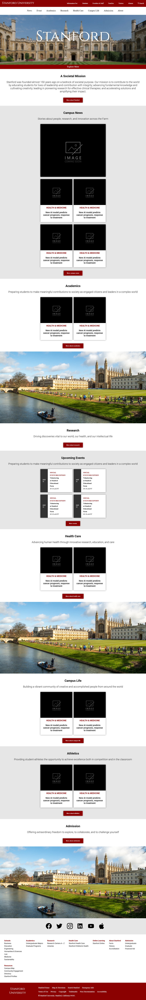

# 🎓 Stanford University Website Replica

A clean, responsive replica of Stanford University's homepage and main sections built with vanilla HTML, CSS, and JavaScript for educational purposes.

⚠️ This is a **static template**, so it does not include backend functionality or dynamic features.

---

## ✨ Features

- Homepage with Hero Section

---

## 🛠️ Tech Stack

### Frontend
- HTML5
- CSS3
- JavaScript (Vanilla)
- No External Frameworks

---

## 📂 Project Structure

```bash
Stanford-Website-Replica/
│
├── style.css
│
├── index.html
│
├── images/...              # Stock Images
│
└── README.md
```

---

## 🚀 Installation

### 1. Clone the Repository
```bash
git clone https://github.com/AbdulWahabXVI/Stanford-Website-Replica.git
```

### 2. Open Project Folder
```bash
cd Stanford-Website-Replica
```

### 3. Run Project
Just open:
```text
index.html
```
in your browser.

---

## 📸 Screenshots

- **Homepage**



---

## 📜 License

This project is licensed under the **MIT License**.

---

## 👨‍💻 Author

Developed by **[Your Name]**  
Educational Project
